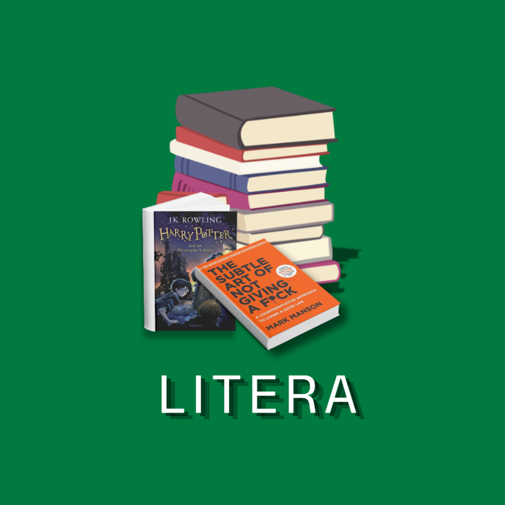

<div align="center">
  
  <h1>📖 Litera</h1>
  <p><strong>Aplikasi Perpustakaan Digital & Pembaca Buku (Tugas Kuliah)</strong></p>

  <!-- Badges -->
  <a href="https://flutter.dev/"></a>
  <a href="https://dart.dev/"></a>
  <a href="https://firebase.google.com/"></a>
  
  <br><br>
</div>

## 📌 Tentang Proyek
**Litera** adalah aplikasi perpustakaan digital berbasis _mobile_ yang dibangun menggunakan Flutter. Proyek ini dikembangkan secara khusus untuk memenuhi tugas kuliah. Aplikasi ini memungkinkan pengguna untuk membaca buku berformat PDF dan EPUB, menyimpan riwayat bacaan, menandai buku favorit (bookmark), serta menyesuaikan tema dan bahasa.

## ✨ Fitur Utama
- 🔐 **Autentikasi Pengguna**: Login dan pendaftaran yang aman menggunakan **Firebase Auth** (Mendukung otentikasi Google).
- 📚 **Pembaca Buku Terintegrasi**: Membaca dokumen berformat **PDF** maupun **EPUB** langsung dari dalam aplikasi.
- ☁️ **Cloud Sync**: Data _Bookmark_ dan _Riwayat Bacaan_ disimpan secara _real-time_ menggunakan **Cloud Firestore**.
- 🌓 **Mode Gelap / Terang**: Pengguna dapat mengubah tema aplikasi ke _Dark Mode_ atau _Light Mode_.
- 🌐 **Multi-bahasa**: Mendukung pelokalan (_Localization_) dalam Bahasa Indonesia dan Bahasa Inggris.
- 🚀 **Performa Optimal**: Memanfaatkan `cached_network_image` untuk pemuatan gambar sampul yang cepat dan efisien.

## 📥 Rilis (Download APK)
Bagi yang ingin mencoba langsung aplikasinya tanpa harus melakukan _build_, silakan unduh versi terbarunya di bawah ini:

<a href="https://github.com/EkaRizqiRomadhon/litera2-final-projek/releases/latest"></a>

## 🛠️ Teknologi & _Packages_ yang Digunakan
- **Framework:** Flutter & Dart
- **Backend (BaaS):** Firebase (Auth, Firestore, Storage)
- **State Management:** Provider
- **Reader:** `syncfusion_flutter_pdfviewer` & `epub_view`
- **UI & Aksesoris:** `google_fonts`, `shimmer`, `cached_network_image`, `cupertino_icons`

## 🚀 Cara Menjalankan Secara Lokal
Jika Anda ingin mengembangkan atau menjalankan _source code_ ini di mesin Anda sendiri:

1. **Clone repositori ini:**
   ```bash
   git clone https://github.com/EkaRizqiRomadhon/litera2-final-projek.git
   cd litera-main-main
   ```
2. **Install semua _dependencies_:**
   ```bash
   flutter pub get
   ```
3. **Persiapkan Firebase:**
   Pastikan Anda sudah memiliki proyek Firebase dan mengonfigurasi `google-services.json` (Android) serta `GoogleService-Info.plist` (iOS) atau menjalankan perintah `flutterfire configure`.

4. **Jalankan Aplikasi:**
   ```bash
   flutter run
   ```

## 📝 Lisensi
Proyek ini dibuat untuk tujuan edukasi (Tugas Kuliah). 
